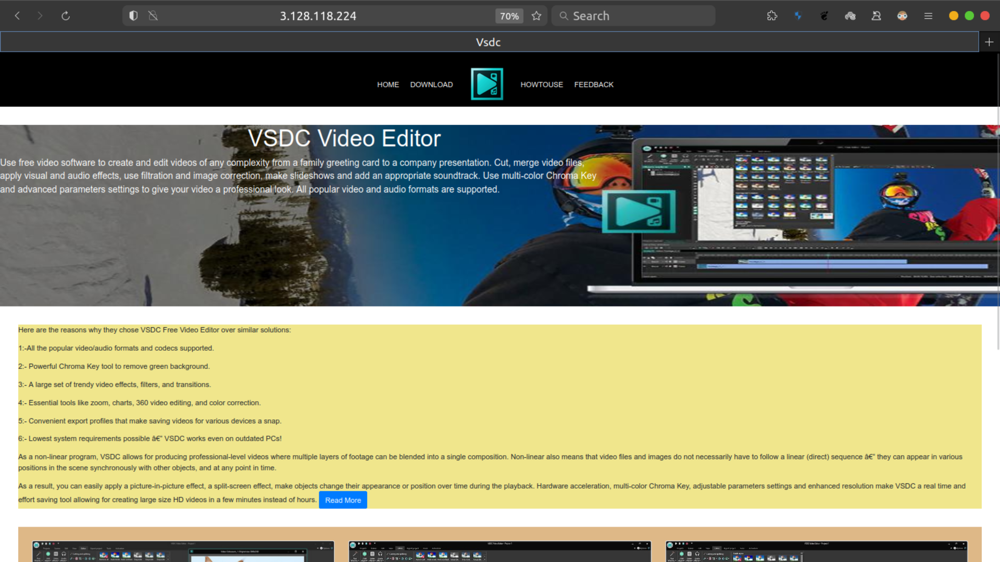

# Multi-Server Web Hosting on AWS EC2

This repository contains instructions and configurations for hosting two different websites on separate AWS EC2 instances, each with its own Apache web server and Elastic IP address.

## Prerequisites

Before you begin, make sure you have the following:

1. AWS Account: You need an AWS account to create and manage EC2 instances and Elastic IPs.

2. Git: Ensure Git is installed on your local machine to clone this repository and manage your project.

## Website 1 Setup

**Step 1: Launch the First EC2 Instance**

Follow these steps to create and configure the first EC2 instance for Website 1:

1. Log in to your AWS Management Console.

2. Go to the EC2 dashboard.

3. Launch a new instance using the "Launch Instance" button.

4. Choose an Amazon Machine Image (AMI), configure instance details, add storage, and configure security groups as needed.

5. Review and launch the instance.

6. Create or select a key pair for SSH access.

7. Launch the instance.

8. Make note of the instance's public IP address for Website 1.

**Step 2: Connect to the First EC2 Instance**

Connect to the first EC2 instance using SSH and your private key:

ssh -i <your-key.pem> ubuntu@<instance1-ip>

**Step 3: Install and Configure Apache for Website 1**

    1. Update the package list and upgrade the installed packages:
 
    • sudo apt update
    • sudo apt upgrade
    
    2. Install Apache2:
  
    • sudo apt install apache2
    
    3. Start the Apache2 service:
   
    • sudo service apache2 start
    
    4. Check Status of the  Apache2 server:
  
    • sudo service apache2 status
    
    5. Upload the files for Website 1 to the /var/www/html directory.
    
    6. Configure Apache to serve Website 1.
    
    7. Restart Apache to apply the changes:
 
    • sudoservice  apache2  restart

## Website 2 Setup

Repeat the same steps as above for the second website on a different EC2 instance with a separate Elastic IP address.

## Additional Notes
  1.  Ensure proper security configurations, firewall rules (Security Groups), and key pairs for each EC2 instance.
 2.   Regularly update and maintain both servers to keep them secure.
      
That's it! You have successfully set up two websites on two different AWS EC2 instances with Apache web servers and assigned separate Elastic IP addresses.

Happy hosting!

# Showcasing My Work Based on the Guide

## Website Showcase

### Website 1: [Custom-vsdcvid](http://3.128.118.224/)

**Description of Website 1 :-**

This project is a custom website designed with inspiration from the VSDC Free Video Editor.

### Website 2: [Custom-oneplus](http://3.128.177.200/)

**Description of Website 2 :-**

This project is a custom website designed with inspiration from the OnePlus.

This README provides an overview of the process for hosting two websites on separate AWS EC2 instances. Be sure to replace placeholders like `<your-key.pem>`, `<instance1-ip>`, and any other placeholders with your actual values. You can include additional details and information specific to your project as needed.

